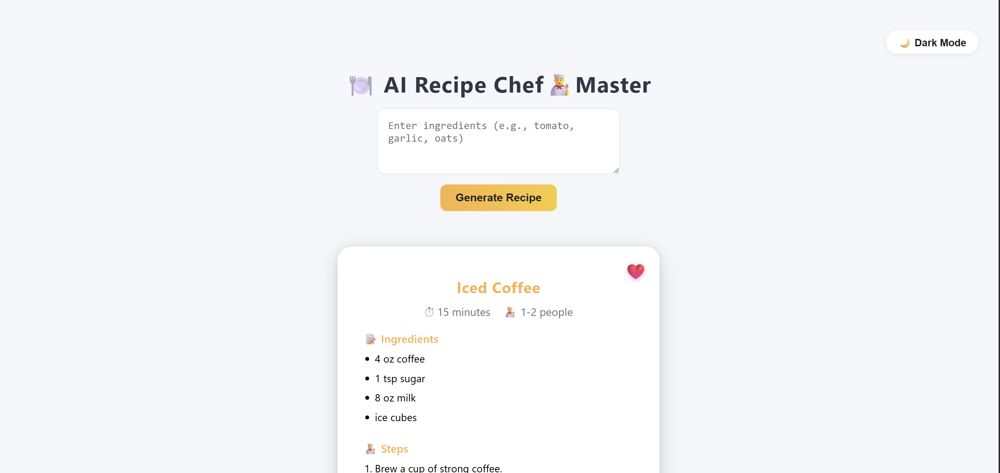
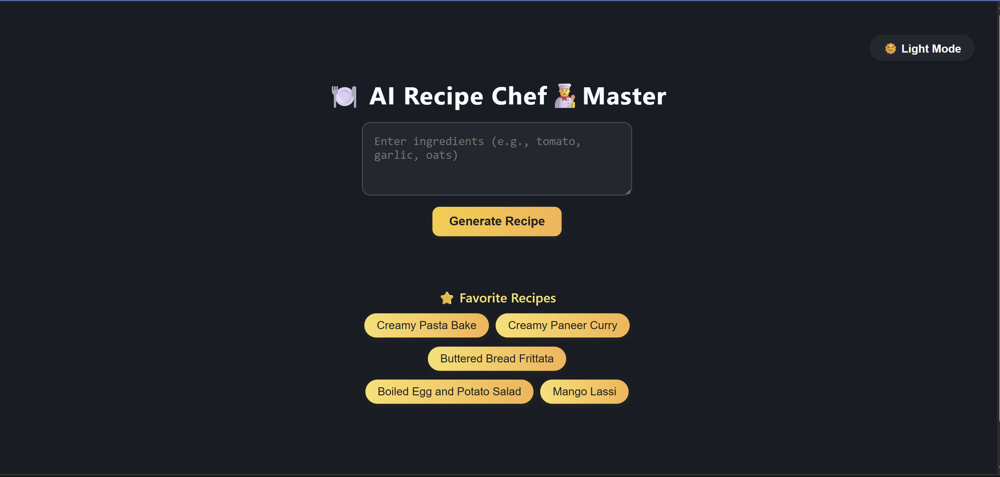
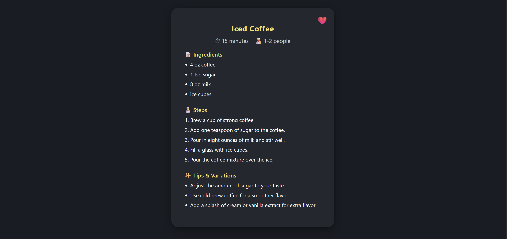

# EasyAIRecipes

A full-stack AI-powered recipe generator and manager built with **React (Vite)** for the frontend and **Flask (Python)** for the backend. Users can generate creative recipes using AI, save favorites, and view them anytime—all in a beautiful, responsive UI.

---

## Features

- 🍅 Generate recipes from a list of ingredients using AI (Ollama)
- ⭐ Save favorite recipes to MongoDB
- 📋 View and load favorite recipes instantly
- 💡 Responsive, modern UI with shimmer loading and dark mode
- 🔒 Environment variable support for secrets and config

---

## Screenshots

### Home Page




### Recipe Card Example


### Favorites Section


---

## Project Structure

```
EasyAIRecipes/
│
├── client/         # React frontend (Vite)
│   ├── src/
│   ├── public/
│   └── ...
│
├── server/         # Flask backend
│   ├── app.py
│   ├── ollama_utils.py
│   ├── requirements.txt
│   └── static/     # Contains built frontend files after build
│
├── build.sh        # Build script for deployment
├── .gitignore
└── README.md
```

---

## Getting Started

### 1. Clone the repository

```sh
git clone https://github.com/Vivid26/EasyAIRecipes.git
cd EasyAIRecipes
```

### 2. Environment Variables

- Create a `.env` file in `server/` with your MongoDB URI and any other secrets:
  ```
  MONGO_URI=your_mongodb_connection_string
  ```

- (Optional) Create a `.env` in `client/` for frontend config.

---

### 3. Install Dependencies

#### Backend (Flask)
```sh
cd server
pip install -r requirements.txt
```

#### Frontend (React)
```sh
cd ../client
npm install
```

---

### 4. Build and Serve Frontend with Flask

From the project root, run:
```sh
npm run --prefix client build
```
This builds the React app and copies it to `server/static/`.

---

### 5. Run the Backend

#### Development (not for production)
```sh
cd server
python app.py
```

#### Production (recommended)
```sh
cd server
gunicorn app:app
```
Or on Windows:
```sh
waitress-serve --port=5000 app:app
```

---

### 6. Access the App

Open [http://localhost:5000/](http://localhost:5000/) in your browser.

---


## Scripts

- **Frontend build & copy:**  
  `npm run build` (in `client/`)  
  (Automatically copies build to `server/static/`)

- **Backend start (dev):**  
  `python app.py` (in `server/`)

- **Backend start (prod):**  
  `gunicorn app:app` (in `server/`)

---

## License

MIT

---

**Made with ❤️ by Priyanka Bhokare**